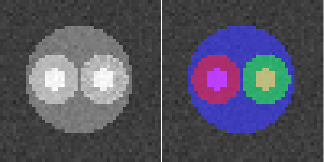

This is a MatLab/C++ library of [1].

The code supports arbitrary number of regions, inclusion and exclusion constraints.

Results from a toy example.

Requirements 
---
1. MATLAB and a c++ compiler.

Getting started
---
1. Run mex -setup.
2. Run example.m in MATLAB, the mex'ed c++ code compiles automatically.

All functionally is described in example.m.

Third party software
---
* To calculate the correct weights for the regularization the code uses
  "Sphere voronoi" [2].
  

* If you use the solver based on lagrangian duality, the code uses the max/flow min solver
	by Yuri Boykov and Vladimir Kolmogorov [3] which reuses flow as described in [4].

* If you use roof duality, the code uses the QPBO software [5].

More resources
---
Martin Rykfors has written a more efficient solver 
if your problem only have inclusions constraints and you are satisfied
with standard connectivities. More details in his [Master thesis](http://www.maths.lth.se/vision/education/pages/Rykfors12/exjobb.pdf) and his
[git repository](https://github.com/MartinRykfors/MultiRegion).

References
----------

1. Johannes Ulén, Petter Strandmark and Fredrik Kahl.  [An Efficient Optimization Framework for Multi-Region Segmentation based on Lagrangian Duality]
 (http://www.maths.lth.se/vision/publications/publications/view_paper.php?paper_id=531)
 IEEE Transactions on Medical Imaging 2013.

2. John Burkardt [Sphere voronoi](http://people.sc.fsu.edu/~jburkardt/m_src/sphere_voronoi/sphere_voronoi.html).

3. Yuri Boykov and Vladimir Kolmogorov. 
  [An Experimental Comparison of Min-Cut/Max-Flow Algorithms for Energy Minimization in Computer Vision.]
  (http://pub.ist.ac.at/~vnk/software.html)
  IEEE pattern analysis and machine intelligence 2004.
	

4. Kohli, Pushmeet, and Philip HS Torr. 
  "Dynamic graph cuts for efficient inference in markov random fields." 
  IEEE pattern analysis and machine intelligence 2007.
	

5. C. Rother, V. Kolmogorov, V. Lempitsky, and M. Szummer. 
  [Optimizing binary MRFs via extended roof duality.]
  (http://pub.ist.ac.at/~vnk/software.html) IEEE Conference on Computer Vision and Pattern Recognition, 2007.
